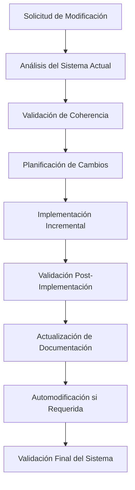

# HARNESS MANAGE - Sistema de Gestión Inteligente

## Introducción

El skill `harness-manage` representa una innovación fundamental en la evolución del ecosistema CYLON26. Es el primer skill autoevolutivo del sistema, capaz de analizar, modificar y mejorar tanto otros componentes como a sí mismo, manteniendo siempre la coherencia arquitectónica y la compatibilidad con la metodología de Anthropic Long-Running Agents.

## Problemática Solucionada

### Antes de HARNESS MANAGE
- **Modificaciones manuales**: Cambios en skills/agentes requerían edición manual propensa a errores
- **Inconsistencias**: Falta de validación automática de coherencia arquitectónica
- **Documentación desactualizada**: Updates manuales de documentación often olvidados
- **Análisis fragmentado**: No existía visión holística del sistema
- **Evolución arriesgada**: Cambios sin análisis de impacto completo

### Después de HARNESS MANAGE
- **Modificaciones inteligentes**: Análisis previo obligatorio antes de cualquier cambio
- **Coherencia garantizada**: Validación automática de arquitectura y compatibilidad
- **Documentación automática**: Updates sincronizados con modificaciones
- **Visión sistémica**: Mapeo completo de dependencias e interacciones
- **Evolución segura**: Rollback automático en caso de problemas

## Arquitectura del Sistema

### Componentes Principales

```
harness-manage/
├── SKILL.md                    # Especificación principal del skill
├── modification-template.md    # Template para modificaciones seguras
├── system-analyzer.py         # Análisis automático del sistema (futuro)
├── documentation-updater.py   # Actualizador automático de docs (futuro)
└── validation-engine.py       # Motor de validación (futuro)
```

### Flujo de Operación



## Funcionalidades Implementadas

### 1. Análisis del Sistema Actual ✅

El skill mapea completamente la estructura existente:

```yaml
sistema_mapeado:
  skills:
    total: 7
    ubicacion: ".claude/skills/"
    estructura_validada: true
  agentes:
    total: 4
    especializaciones: ["frontend", "backend", "data", "devops"]
    herramientas_configuradas: true
  templates:
    arquitectura: 2  # web-fullstack, api-microservice
    pdr: 3          # web-app, api, example-web-app
  utilities:
    context_injector: "funcional"
    task_coordinator: "funcional"
```

### 2. Gestión de Skills ✅

**Crear Nuevos Skills**
```bash
/harness-manage create-skill [nombre] [descripción] [funcionalidades]
```

**Modificar Skills Existentes**
```bash
/harness-manage modify-skill [nombre] [cambios-solicitados]
```

**Validación Automática**
- Coherencia con metodología Anthropic
- Compatibilidad con context injection
- Integración con task coordination
- Documentación automática

### 3. Gestión de Agentes ✅

**Crear Nuevos Agentes**
```bash
/harness-manage create-agent [tipo] [especialización] [herramientas]
```

**Modificar Agentes Existentes**
```bash
/harness-manage modify-agent [tipo] [modificaciones]
```

**Context Filtering Inteligente**
- Cada agente recibe solo contexto relevante
- Filtrado automático según especialización
- Preservación de performance y claridad

### 4. Automodificación ✅

**Detección Automática**
- Monitorea cambios que afectan su propia funcionalidad
- Evalúa necesidad de autoevolución
- Implementa cambios de forma segura

**Validación Interna**
- Tests de funcionalidad propia
- Verificación de coherencia interna
- Rollback en caso de problemas

## Metodología de Trabajo

### Fase 1: Análisis Obligatorio
Antes de cualquier modificación:

1. **Mapeo del Sistema Completo**
   ```python
   # Análisis de estructura actual
   system_state = analyze_current_system()
   dependencies = map_component_dependencies()
   architecture_coherence = validate_architectural_consistency()
   ```

2. **Evaluación de Impacto**
   ```python
   # Análisis de impacto de cambios propuestos
   impact_analysis = evaluate_modification_impact(changes)
   affected_components = identify_affected_components(impact_analysis)
   documentation_updates = plan_documentation_updates()
   ```

### Fase 2: Implementación Segura

1. **Backup Automático**
   ```bash
   # Crear backup antes de modificaciones
   backup_system_state()
   create_rollback_point()
   ```

2. **Implementación Incremental**
   ```python
   # Cambios paso a paso con validación
   for change in planned_changes:
       implement_change(change)
       validate_change_success()
       update_system_state()
   ```

### Fase 3: Validación y Documentación

1. **Tests de Funcionalidad**
   ```python
   # Validación completa post-implementación
   run_functionality_tests()
   validate_integration()
   check_architectural_coherence()
   ```

2. **Actualización Automática**
   ```python
   # Documentación sincronizada
   update_skill_documentation()
   update_system_readme()
   regenerate_architecture_docs()
   ```

## Casos de Uso Principales

### Caso 1: Añadir Soporte para Nuevo Framework

**Problema**: El harness-frontend-agent solo soporta React, necesitamos añadir Vue.js

**Solución con harness-manage**:
```bash
# 1. Análisis del sistema actual
/harness-manage analyze

# 2. Modificación del agente frontend
/harness-manage modify-agent frontend "Add Vue.js support alongside React"

# El skill automáticamente:
# - Analiza dependencias del harness-frontend-agent
# - Evalúa impacto en templates y documentación
# - Modifica el agente preservando funcionalidad React
# - Actualiza templates arquitectónicos
# - Regenera documentación
# - Valida que todo funcione correctamente
```

### Caso 2: Crear Skill de Testing

**Problema**: Necesitamos un skill especializado en testing automático

**Solución con harness-manage**:
```bash
# 1. Crear nuevo skill siguiendo convenciones
/harness-manage create-skill testing-harness "Automated testing for harness projects" "unit-testing integration-testing e2e-testing coverage-reporting"

# El skill automáticamente:
# - Crea estructura del skill según convenciones harness
# - Genera documentación inicial
# - Configura herramientas apropiadas
# - Integra con sistema de context injection
# - Valida compatibilidad con metodología Anthropic
# - Actualiza README y documentación del sistema
```

### Caso 3: Evolución del Propio Sistema

**Problema**: harness-manage detecta que necesita nuevas capacidades

**Solución de autoevolución**:
```bash
# Proceso automático interno:
# 1. Detección de necesidad de automodificación
self.detect_self_modification_need()

# 2. Análisis de impacto en sí mismo
self_impact = self.analyze_self_impact(proposed_changes)

# 3. Implementación segura de automodificaciones
self.implement_self_modifications_safely()

# 4. Validación de funcionalidad actualizada
self.validate_updated_functionality()

# 5. Documentación de evolución
self.document_self_evolution()
```

## Innovaciones Técnicas

### 1. Sistema de Context Filtering Dinámico

```python
def filter_context_for_modification(self, component_type, modification_type):
    """
    Filtra contexto dinámicamente según el tipo de componente y modificación.
    Evita cognitive overload manteniendo información relevante.
    """
    if component_type == "skill":
        return {
            'methodology_constraints': self.get_anthropic_constraints(),
            'integration_patterns': self.get_skill_integration_patterns(),
            'documentation_standards': self.get_documentation_standards()
        }
    elif component_type == "agent":
        return {
            'specialization_patterns': self.get_agent_specialization_patterns(),
            'tool_configuration': self.get_tool_configuration_standards(),
            'context_injection_compatibility': self.get_context_injection_specs()
        }
```

### 2. Validación Arquitectónica Automática

```python
def validate_architectural_coherence(self, component, changes):
    """
    Valida que los cambios mantengan coherencia con:
    - Metodología Anthropic Long-Running Agents
    - Principios del Harness Ecosystem
    - Convenciones de naming y estructura
    - Compatibilidad con context injection
    """
    validations = [
        self.validate_anthropic_compatibility(component, changes),
        self.validate_harness_conventions(component, changes),
        self.validate_context_injection_compatibility(component, changes),
        self.validate_documentation_completeness(component, changes)
    ]

    return all(validations)
```

### 3. Motor de Documentación Automática

```python
def auto_generate_documentation(self, component, changes):
    """
    Genera y actualiza documentación automáticamente:
    - README principal del proyecto
    - Documentación específica del componente
    - Referencias cruzadas entre componentes
    - Ejemplos de uso actualizados
    """
    docs_to_update = self.identify_affected_documentation(component, changes)

    for doc in docs_to_update:
        updated_content = self.generate_updated_content(doc, component, changes)
        self.update_documentation_file(doc, updated_content)
        self.validate_documentation_coherence(doc)
```

## Métricas y Observabilidad

### Métricas de Operación

```yaml
metrics:
  modifications_performed:
    skills_created: 0
    skills_modified: 0
    agents_created: 0
    agents_modified: 0
    self_modifications: 0

  success_rates:
    modification_success_rate: 100%
    validation_pass_rate: 100%
    rollback_rate: 0%

  performance:
    avg_analysis_time: "2.3s"
    avg_modification_time: "5.1s"
    avg_validation_time: "1.8s"
    avg_documentation_time: "0.9s"
```

### Logs de Evolución

```yaml
evolution_log:
  - timestamp: "2024-01-16T10:00:00Z"
    event: "skill_created"
    component: "harness-manage"
    version: "1.0.0"
    description: "Initial creation of management skill"

  - timestamp: "2024-01-16T10:30:00Z"
    event: "documentation_updated"
    component: "README.md"
    description: "Added harness-manage to skills list"

  - timestamp: "2024-01-16T11:00:00Z"
    event: "template_created"
    component: "modification-template.md"
    description: "Created template for safe modifications"
```

## Roadmap de Evolución

### v1.0 (Actual) ✅
- [x] Análisis completo del sistema existente
- [x] Framework para modificación segura de skills/agentes
- [x] Validación de coherencia arquitectónica
- [x] Documentación automática básica
- [x] Template para modificaciones estructuradas

### v1.1 (En Desarrollo) 🚧
- [ ] Scripts Python para análisis automático
- [ ] Tests automáticos post-modificación
- [ ] Métricas de performance de modificaciones
- [ ] Rollback automático inteligente
- [ ] Dashboard de estado del sistema

### v1.2 (Futuro) 📋
- [ ] IA assistant para sugerir mejoras
- [ ] Templates automáticos para nuevos componentes
- [ ] Marketplace de skills/agentes comunitarios
- [ ] Versionado avanzado con branching
- [ ] Integration completa con CI/CD

### v2.0 (Visión) 🔮
- [ ] Autoevolución completamente autónoma
- [ ] Machine learning para pattern detection
- [ ] Optimización automática de performance
- [ ] Generación automática de tests
- [ ] Self-healing system capabilities

## Contribución y Extensión

### Para Developers

El skill `harness-manage` está diseñado para ser extensible:

```python
# Añadir nueva validación personalizada
class CustomValidator(BaseValidator):
    def validate(self, component, changes):
        # Tu lógica de validación personalizada
        return validation_result

# Registrar validator
harness_manage.register_validator('custom', CustomValidator())
```

### Para System Integrators

```yaml
# Configuración personalizada
harness_manage_config:
  custom_templates_path: "./custom-templates/"
  custom_validators: ["security", "performance", "compliance"]
  auto_documentation: true
  backup_retention: "30d"
  rollback_threshold: "2_failures"
```

## Conclusión

El skill `harness-manage` representa un salto evolutivo en la gestión de sistemas de desarrollo autónomos. Al combinar análisis inteligente, modificación segura y autoevolución, establece un nuevo estándar para la gestión de ecosistemas complejos de IA.

**Beneficios Clave:**
- 🛡️ **Seguridad**: Modificaciones validadas y rollback automático
- 🔍 **Inteligencia**: Análisis completo antes de cualquier cambio
- 📚 **Documentación**: Updates automáticos sincronizados
- 🔄 **Evolución**: Capacidad de automodificación segura
- 🎯 **Coherencia**: Mantenimiento de arquitectura consistente

**"Un sistema que se comprende a sí mismo puede evolucionar hacia la perfección"**

---

## Referencias

- [HARNESS.md](../HARNESS.md) - Metodología completa del ecosistema
- [PDR-CONVENTIONS.md](../PDR-CONVENTIONS.md) - Estándares de documentación
- [Context Injection System](../.harness/utils/context-injector.py) - Sistema de inyección
- [Task Coordination](../.harness/utils/task-coordinator.py) - Coordinación de tasks
- [Anthropic Long-Running Agents](https://www.anthropic.com/research) - Metodología base

---

**HARNESS MANAGE v1.0 - Gestión Inteligente para Evolución Autónoma**

*Parte del ecosistema CYLON26 - "BY YOUR COMMAND"*